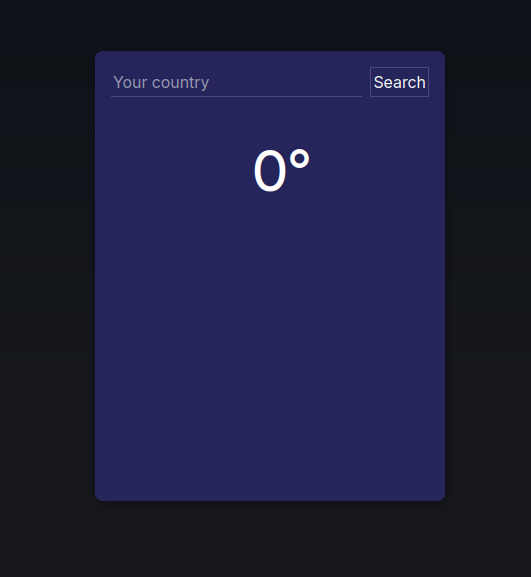

# Weather App
A simple weather program, as a practice of asynchrony and use of apis.

## Live Demo:

### Resources:
- [Open Meteo API](https://open-meteo.com/)
- [Rest Countries API](https://restcountries.com/)
- [Google Fonts](https://fonts.google.com/)
- [Css Gradient](https://cssgradient.io/)

## Future plans:
One of the things I have in mind is to make a pretty considerable improvement, since I didn't spend the time I wanted to, so for now it's a big piece of shit, but I have a big list of things I plan to do with this project.

### Todo:
- [ ] Intregrate Tailwind CSS
- [ ] Rewrite it in Typescript
